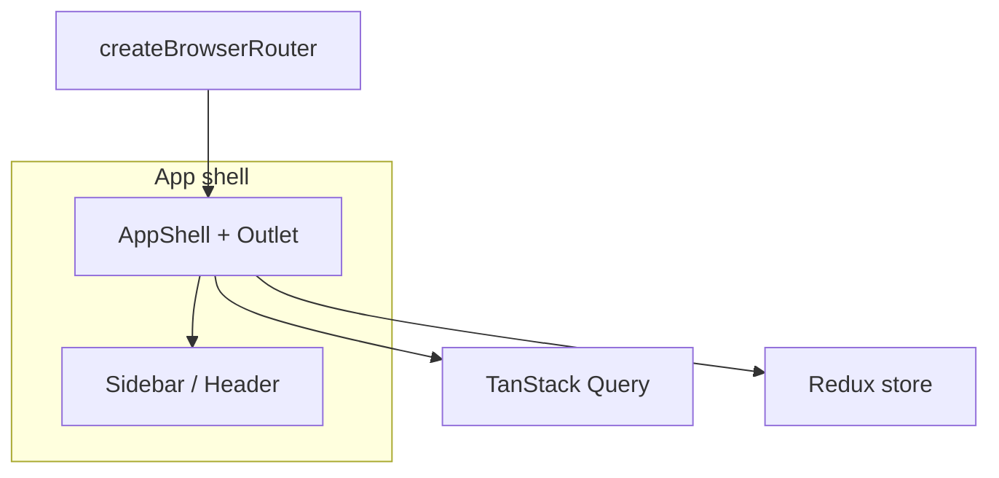

# React Concepts Hub — CSR Learning Project

This document is your **single source of truth** for what to build, in what order, and what “done” looks like. The codebase is intentionally a **skeleton**: you implement the concepts while the **idea, routes, and folder layout** stay fixed.

## Learning goals

By completing this project you will gain **hands-on, comprehensive** knowledge of **Client-Side Rendering (CSR)** in modern web apps:

| Topic                       | What you will practice                                                               |
| --------------------------- | ------------------------------------------------------------------------------------ |
| **CSR & SPA model**         | One HTML shell, JS bundles hydrate the UI, navigation without full page reloads      |
| **Routing**                 | Nested layouts, URLs as state, params, programmatic navigation, code-splitting       |
| **Data fetching & caching** | TanStack Query (React Query): queries, mutations, cache keys, invalidation, devtools |
| **Global state**            | Redux Toolkit: slices, thunks, typed hooks; when to use Redux vs server cache        |
| **Template rendering**      | Conditional UI, lists/keys, composition patterns (e.g. compound components)          |
| **Forms & validation**      | React Hook Form + Zod: controlled patterns, errors, field arrays                     |
| **Animations**              | Framer Motion: layout, presence, gestures, meaningful motion without jank            |
| **Build tooling**           | Vite (dev server, HMR, build), Babel (transforms), conceptual Webpack comparison     |

**API:** Use [JSONPlaceholder](https://jsonplaceholder.typicode.com) (`/posts`, `/todos`, `/users`) for realistic async work.

---

## Recommended study order

1. **Routing** — Wire `[router/index.tsx](src/router/index.tsx)`, `[AppShell](src/components/layout/AppShell.tsx)`, `[Sidebar](src/components/layout/Sidebar.tsx)`; add lazy routes and a shared loading UI.
2. **React Query** — Implement `[postsApi](src/features/posts/postsApi.ts)` + `[PostsPage](src/features/posts/PostsPage.tsx)` / `[PostDetail](src/features/posts/PostDetail.tsx)`: loading, error, mutation (e.g. optimistic “favorite”), invalidation.
3. **Redux Toolkit** — Complete `[usersSlice](src/features/users/usersSlice.ts)` and `[UsersPage](src/features/users/UsersPage.tsx)`: `createAsyncThunk`, selectors, error handling; optionally compare with a tiny RTK Query endpoint in comments or a separate branch.
4. **Forms** — `[TodoForm](src/features/todos/TodoForm.tsx)` + `[TodoList](src/features/todos/TodoList.tsx)`: Zod schema, RHF `useForm` / `Controller`, submit to JSONPlaceholder, reset, field-level errors.
5. **Animations** — `[AnimationsPage](src/features/animations/AnimationsPage.tsx)` and demos under `[demos/](src/features/animations/demos)`: `motion`, `AnimatePresence`, list reorder, page transition (e.g. on route change via layout).

---

## Architecture (target)

- **Router** owns URL ↔ screen mapping.
- **QueryClientProvider** wraps the tree so posts/todos fetching uses TanStack Query.
- **Redux Provider** wraps the tree for global client state (users module).
- **Feature folders** under `src/features/`* keep each topic isolated.

---

## Module briefs & acceptance criteria

### 1. Posts — TanStack Query (`/posts`, `/posts/:postId`)

**Files:** `[PostsPage.tsx](src/features/posts/PostsPage.tsx)`, `[PostDetail.tsx](src/features/posts/PostDetail.tsx)`, `[PostCard.tsx](src/features/posts/PostCard.tsx)`, `[postsApi.ts](src/features/posts/postsApi.ts)`

**Learn:** `useQuery`, `queryKey` design, `useMutation`, invalidation, `useInfiniteQuery` (optional stretch), DevTools.

**Acceptance criteria**

- List posts from `/posts` with loading + error UI.
- Navigate to `/posts/:postId` and load a single post (and optionally comments: `/posts/:id/comments`).
- At least one **mutation** (e.g. fake “save” or local optimistic update) with **query invalidation** or cache update.
- React Query Devtools visible in development (`src/main.tsx`).

---

### 2. Users — Redux Toolkit (`/users`)

**Files:** `[usersSlice.ts](src/features/users/usersSlice.ts)`, `[UsersPage.tsx](src/features/users/UsersPage.tsx)`, `[UsersTable.tsx](src/features/users/UsersTable.tsx)`, `[store/hooks.ts](src/store/hooks.ts)`

**Learn:** `configureStore`, `createSlice`, `createAsyncThunk`, typed `useAppDispatch` / `useAppSelector`, normalization (optional).

**Acceptance criteria**

- Fetch users list via **thunk** (or RTK listener) and store in Redux.
- Derived UI state with memoized selectors (e.g. filter by name).
- Clear loading / error / success states in the UI.

**Reflection prompt:** When would you keep data in **React Query** vs **Redux**? Write your answer in `[BuildToolsPage](src/features/build-tools/BuildToolsPage.tsx)` or a `docs/notes.md` you add yourself.

---

### 3. Todos — Forms & validation (`/todos`)

**Files:** `[TodosPage.tsx](src/features/todos/TodosPage.tsx)`, `[TodoForm.tsx](src/features/todos/TodoForm.tsx)`, `[TodoList.tsx](src/features/todos/TodoList.tsx)`

**Learn:** React Hook Form performance model, Zod schemas, `zodResolver`, accessible labels/errors, optional field arrays.

**Acceptance criteria**

- Create todo via POST with client-side validation (title required, max length, etc.).
- Display server validation mismatch (simulate by mapping errors) or inline field errors from Zod.
- Reset form on success; list updates (React Query **or** local state — pick one and justify).

---

### 4. Animations (`/animations`)

**Files:** `[AnimationsPage.tsx](src/features/animations/AnimationsPage.tsx)`, `[demos/*.tsx](src/features/animations/demos)`

**Learn:** Framer Motion basics, `AnimatePresence`, layout animations, reduced-motion consideration.

**Acceptance criteria**

- At least three distinct motion demos (fade, staggered list, layout or drag).
- Respect `prefers-reduced-motion` where reasonable.

---

### 5. Cross-cutting: routing & code splitting

**Files:** `[router/index.tsx](src/router/index.tsx)`, `[AppShell.tsx](src/components/layout/AppShell.tsx)`

**Acceptance criteria**

- Nested layout with `<Outlet />`.
- Lazy-loaded feature routes with `<Suspense>` fallback (`[Spinner](src/components/ui/Spinner.tsx)`).
- 404 / unknown route handling (`path: '*'`) — add a small `NotFound` page if you like.

---

### 6. Shared hooks & types

**Files:** `[useDebounce.ts](src/hooks/useDebounce.ts)`, `[types/index.ts](src/types/index.ts)`

**Acceptance criteria**

- Debounce used in at least one user-facing flow (e.g. search filter on posts or users).
- Shared types for API entities used in multiple modules.

---

## Suggested JSONPlaceholder endpoints

| Entity   | Endpoint                       | Notes                      |
| -------- | ------------------------------ | -------------------------- |
| Posts    | `GET /posts`, `GET /posts/:id` | Primary React Query module |
| Comments | `GET /posts/:id/comments`      | Optional nested resource   |
| Users    | `GET /users`                   | Primary Redux module       |
| Todos    | `GET /todos`, `POST /todos`    | Forms + mutations          |

Base URL: `https://jsonplaceholder.typicode.com`

---

## Quality bar (optional but valuable)

- **Accessibility:** keyboard navigable sidebar, focus styles, form labels.
- **Performance:** avoid unnecessary re-renders (memo where justified); virtualize long lists only if needed.
- **Testing:** add Vitest + RTL later for forms and a query hook (not required for first pass).

---

## File map (skeleton)

See the repo tree under `src/` — each file starts with a `TODO` for you to replace with real behavior. **Do not** change the overall module boundaries without good reason; the goal is to spend energy on concepts, not restructuring.

When everything above is implemented, you should be able to demo **routing**, **cached server state**, **global client state**, **validated forms**, **motion**, and explain **how the bundle is built** — the core of CSR literacy.